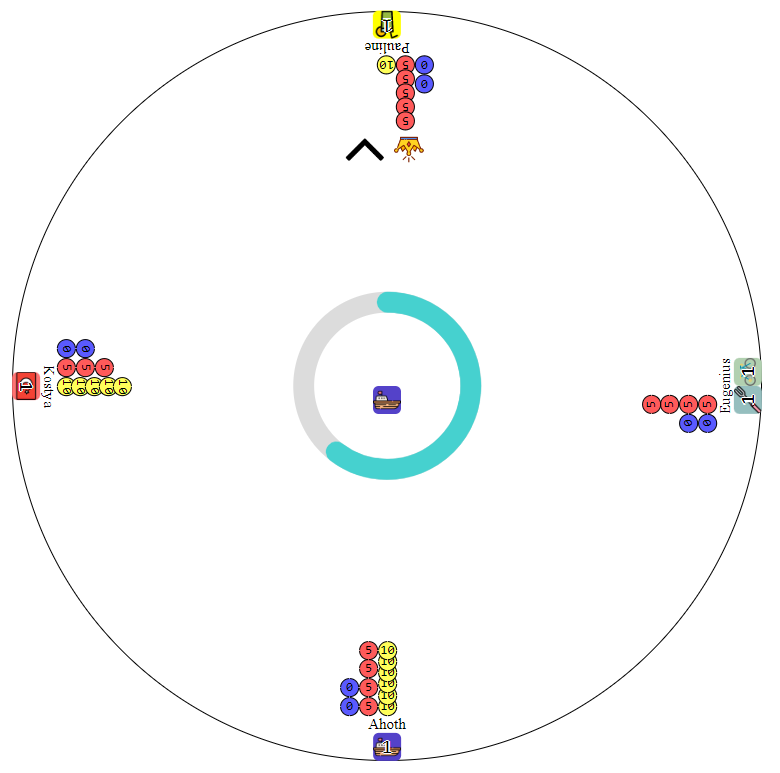

```
   _____                                                       _
  / ____|                                                     | |
 | |        ___    _ __ ___    _ __     __ _   _ __     __ _  | |_    __ _
 | |       / _ \  | '_ ` _ \  | '_ \   / _` | | '_ \   / _` | | __|  / _` |
 | |____  | (_) | | | | | | | | |_) | | (_| | | | | | | (_| | | |_  | (_| |
  \_____|  \___/  |_| |_| |_| | .__/   \__,_| |_| |_|  \__,_|  \__|  \__,_|
                              | |
                              |_|                               O N L I N E
```

## Acknowledgment

Massive thanks to Yiotro for inspiring us to make a networked version of the game Companata. You can find the original game and many of Yiotro's other amazing creations here:
https://play.google.com/store/apps/developer?id=Yiotro&hl=en_US&gl=US

## Visuals



## Description

Companata is a game about bidding, mind games, and last second money grabs. Your goal is to get four sets of four items but, there aren't quite enough items to go around. Will you be the first to complete your collection or will your friends outbid you at the last second.

## Rules

Here at _games made quick_ industries we firmly believe that playing and learning the rules as you go is the best way to play a game. As an added bonus you avoid the pointless hassle of reading rules and then having to explain them again halfway through the game.

## Settings

In <span style="color:rgb(240, 110, 84)">/src/server/common/settiings.js</span> the following values can be adjusted to customize the game.

<span style="color:rgb(102, 240, 84)">EXPECTED_PLAYERS</span> - The number of people playing  
<span style="color:rgb(102, 240, 84)">STACK_SIZE</span> - Amount of each item  
<span style="color:rgb(102, 240, 84)">STACKS_TO_WIN</span> - Number of items needed to win  
<span style="color:rgb(102, 240, 84)">DIFFICULTY</span> - Number representing the difficulty

More details about each of these settings can be found in the file.

## Project status

Done and dusted

## Authors

- Alexander Ivanov (https://github.com/alexanderivanov2424)
- Jason Crowley (https://github.com/jason-crowley)

## License

## [MIT](https://choosealicense.com/licenses/mit/)

<hr style="border:2px solid">

# How to Run

## Backend

This is where the game logic happens

> navigate to: compananta/src/server  
> run: npm start

## Server

This is what serves the page to the client

> navigate to: compananta/  
> run: npm start

## Ngrok

We used ngrok so friends not on our wifi can also play

ngrok downloaded as an exe:

> navigate to ngrok download path
> start ngrok.exe  
> run: ngrok http 3000

If you have ngrok in your path like a normal person:

> run: ngrok http 3000

To kill loose ngrok sessions on windows:

> taskkill /f /im ngrok.exe
